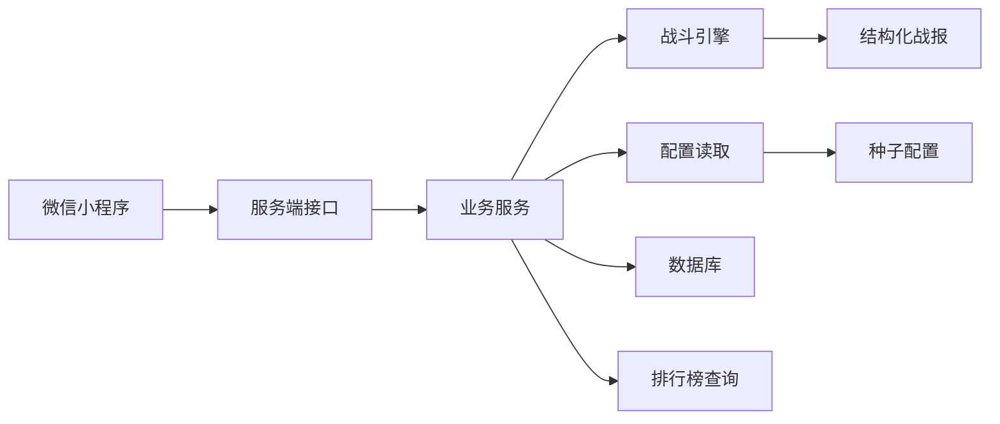

# Buddy Brawl 技术路线设计

## 1. 文档目标

本文档用于确认 `Buddy Brawl` 微信小程序的技术路线。当前后端正式服务器尚未到位，因此首阶段使用本地 Docker 承载独立服务端、数据库和开发依赖，保证开发、测试和后续迁移路径清晰。

本文档只定义技术路线和模块边界，不替代后续详细实现计划。

## 2. 已确认前提

- 产品形态：微信小程序。
- 美术包装：原创熊猫乱斗。
- 后端方向：独立服务端。
- 开发环境：先使用本地 Docker。
- 核心玩法：挂机养成 + 真实玩家异步自动 PK + 战报 + 排名。
- 首版装备：支持穿戴、替换和简单强化。
- 数据原则：配置化，避免写死展示数据。

## 3. 总体技术路线

### 3.1 推荐架构

采用“微信小程序前端 + 独立服务端 + 共享战斗与配置包 + 本地 Docker 数据环境”的结构。



### 3.2 关键原则

- 前端只提交操作意图，不直接决定资源、战斗结果或排名。
- 服务端负责登录、数据读写、挂机结算、战斗结算、奖励发放和排行榜。
- 战斗引擎独立成包，前后端都不直接散写战斗规则。
- 配置数据独立成包或配置目录，宠物、装备、技能、关卡、掉落、任务都从配置读取。
- 本地 Docker 环境应尽量接近未来正式服务器环境，减少迁移成本。

## 4. 技术选型

### 4.1 前端

推荐：微信原生小程序 + TypeScript。

原因：

- 目标平台明确是微信小程序，原生路线最直接。
- 避免跨端框架带来的构建复杂度。
- 小程序页面、分享、登录、分包等能力更贴近平台。
- TypeScript 有利于多智能体协作时保持数据结构一致。

前端职责：

- 页面展示。
- 用户交互。
- 调用服务端接口。
- 本地轻量状态管理。
- 展示战报、排行榜、装备和挂机收益。

前端不负责：

- 最终战斗结算。
- 最终挂机收益结算。
- 奖励发放。
- 排名变更。

### 4.2 服务端

推荐：Node.js + TypeScript + Fastify。

原因：

- TypeScript 与小程序前端、共享包一致。
- Fastify 足够轻量，适合首版快速交付。
- 结构清晰，接口测试成本低。
- 后续可以迁移到云服务器、容器服务或其他部署平台。

服务端职责：

- 微信登录态换取与玩家初始化。
- 玩家档案、宠物、装备、任务、战报、排行榜数据读写。
- 挂机收益结算。
- 装备穿戴与强化。
- 异步自动战斗发起与结算。
- 战报持久化。
- 配置读取与版本管理。

### 4.3 数据库

推荐：PostgreSQL。

原因：

- 关系数据明确：玩家、宠物、装备、战报、任务、排行榜都适合关系建模。
- 支持事务，适合奖励领取、装备强化、战斗结算等需要一致性的操作。
- 后续正式服务器迁移路径成熟。
- 本地 Docker 启动简单。

首版不强制引入 Redis。排行榜首版可以用 PostgreSQL 查询和索引完成，等并发和数据量上来后再考虑缓存。

### 4.4 数据访问层

推荐：Prisma。

原因：

- Schema 清晰，便于多智能体理解数据模型。
- 迁移文件可追踪。
- TypeScript 类型生成稳定。
- 本地 Docker + PostgreSQL 开发体验成熟。

注意：

- Prisma 只负责数据访问，不承载业务规则。
- 业务规则写在服务层和独立包中。

### 4.5 测试

推荐：

- Vitest：单元测试，覆盖战斗引擎、配置校验、服务层纯逻辑。
- 服务端接口测试：使用 Fastify 内置注入能力或轻量接口测试。
- 小程序端首版先做关键工具函数测试，页面端以人工验收和后续自动化补充为主。

## 5. 本地 Docker 路线

### 5.1 本地容器组成

首阶段建议使用：

- `api`：独立服务端容器。
- `postgres`：本地 PostgreSQL 数据库。
- `adminer`：数据库管理界面，可选。

首版暂不引入：

- Redis。
- 消息队列。
- 对象存储。
- 搜索引擎。

这些能力目前不是首版闭环必需项。

### 5.2 本地访问方式

建议端口：

- 服务端接口：`http://localhost:3000`
- PostgreSQL：`localhost:5432`
- 数据库管理界面：`http://localhost:8080`

微信小程序开发工具中，开发阶段请求本地接口需要开启“不校验合法域名”选项。上线前必须切换为正式 HTTPS 域名。

### 5.3 Docker 文件规划

建议后续创建：

- `docker-compose.yml`：定义本地服务、数据库和管理界面。
- `services/api/Dockerfile`：服务端镜像。
- `services/api/.env.example`：服务端环境变量模板。
- `services/api/prisma/schema.prisma`：数据库模型。

### 5.4 环境变量

服务端至少需要：

- `DATABASE_URL`：数据库连接。
- `WECHAT_APP_ID`：微信小程序应用标识。
- `WECHAT_APP_SECRET`：微信小程序密钥。
- `JWT_SECRET`：本地登录态签名密钥。
- `CONFIG_VERSION`：当前配置版本。

本地开发可以使用示例值；真实密钥不提交到仓库。

## 6. 推荐项目结构

建议采用轻量单仓库结构：

```text
BuddyBrawl/
  apps/
    miniprogram/
      pages/
      components/
      services/
      app.ts
      app.json
      app.wxss
  services/
    api/
      src/
        modules/
        routes/
        plugins/
        server.ts
      prisma/
        schema.prisma
      Dockerfile
      package.json
  packages/
    battle/
      src/
        engine.ts
        types.ts
        report.ts
      package.json
    configs/
      src/
        pets.ts
        levels.ts
        equipment.ts
        skills.ts
        stages.ts
        drops.ts
        tasks.ts
      package.json
    shared/
      src/
        api-types.ts
        domain-types.ts
      package.json
  docs/
  docker-compose.yml
  package.json
  pnpm-workspace.yaml
```

### 6.1 `apps/miniprogram`

微信小程序前端。

职责：

- 页面与组件。
- 请求服务端接口。
- 展示玩家、宠物、装备、冒险、竞技、战报和排行榜。

### 6.2 `services/api`

独立服务端。

职责：

- 路由和接口。
- 登录鉴权。
- 数据读写。
- 调用战斗引擎。
- 处理事务和奖励发放。

### 6.3 `packages/battle`

独立战斗引擎。

职责：

- 根据宠物快照、装备快照、技能配置和随机种子结算战斗。
- 输出结构化战报。
- 保证同一输入和同一随机种子得到同一结果。

### 6.4 `packages/configs`

种子配置。

职责：

- 提供首版宠物、装备、技能、关卡、掉落、任务、竞技参数。
- 提供配置校验函数。

### 6.5 `packages/shared`

共享类型。

职责：

- 定义前后端共用的接口类型。
- 定义领域对象类型。
- 降低接口字段不一致风险。

## 7. 服务端模块拆分

### 7.1 账号模块

职责：

- 处理微信登录。
- 创建或读取玩家档案。
- 签发本地登录态。

接口建议：

- `POST /auth/wechat-login`
- `GET /me`

### 7.2 宠物模块

职责：

- 读取主宠物。
- 升级宠物。
- 计算展示战力。

接口建议：

- `GET /pet/current`
- `POST /pet/level-up`

### 7.3 冒险模块

职责：

- 读取挂机状态。
- 结算挂机收益。
- 领取收益。
- 推进关卡。

接口建议：

- `GET /adventure/status`
- `POST /adventure/claim`
- `POST /adventure/challenge`

### 7.4 装备模块

职责：

- 读取背包。
- 穿戴装备。
- 替换装备。
- 简单强化装备。

接口建议：

- `GET /inventory/equipment`
- `POST /equipment/equip`
- `POST /equipment/enhance`

### 7.5 竞技模块

职责：

- 获取推荐对手。
- 发起真实玩家异步 PK。
- 结算积分。
- 保存战报。

接口建议：

- `GET /arena/opponents`
- `POST /arena/challenge`
- `GET /arena/recent-battles`

### 7.6 战报模块

职责：

- 查询战报详情。
- 返回结构化战报和文本摘要。

接口建议：

- `GET /battles/:battleId`

### 7.7 排行榜模块

职责：

- 查询排行榜。
- 查询我的排名。

接口建议：

- `GET /leaderboard`
- `GET /leaderboard/me`

### 7.8 任务模块

职责：

- 读取任务进度。
- 更新任务进度。
- 领取任务奖励。

接口建议：

- `GET /tasks`
- `POST /tasks/:taskId/claim`

## 8. 数据模型方向

首版建议包含以下表：

- `players`：玩家档案。
- `pets`：玩家主宠物。
- `equipment_instances`：玩家装备实例。
- `adventure_states`：挂机冒险状态。
- `battle_records`：战斗记录与战报。
- `arena_states`：竞技积分和挑战次数。
- `task_progress`：任务进度。
- `reward_logs`：奖励流水。
- `config_versions`：配置版本记录。

### 8.1 事务要求

以下操作必须使用事务：

- 领取挂机收益。
- 装备强化。
- 发起竞技挑战并结算积分。
- 领取任务奖励。

原因：

- 这些操作涉及资源扣减、资源发放和状态变更。
- 事务可以避免重复领取、重复扣费或战斗记录与积分不一致。

## 9. 战斗引擎路线

战斗引擎必须独立于服务端路由，便于测试和后续模拟。

输入：

- 攻方快照。
- 防方快照。
- 技能配置。
- 随机种子。
- 战斗场景。

输出：

- 胜负结果。
- 回合事件数组。
- 双方最终状态。
- 奖励上下文。
- 可复盘随机种子。

首版战斗规则：

- 根据速度决定先手。
- 每回合执行一次行动。
- 主动技能按冷却和触发条件自动释放。
- 普通攻击作为默认动作。
- 支持暴击。
- 支持最大回合数。
- 超出最大回合后按剩余生命比例判定胜负。

## 10. 配置路线

首版配置以代码仓库内结构化配置为主，后续再迁移到配置后台。

必须配置化：

- 熊猫基础模板。
- 等级经验表。
- 属性成长表。
- 装备模板。
- 装备品质。
- 装备强化参数。
- 技能模板。
- 冒险关卡。
- 掉落池。
- 任务。
- 竞技参数。

配置需要提供校验：

- 必填字段不为空。
- 装备部位合法。
- 技能效果类型合法。
- 掉落权重总和有效。
- 关卡引用的掉落池存在。
- 任务奖励引用的奖励类型合法。

## 11. 本地开发流程

### 11.1 启动顺序

1. 启动 Docker。
2. 启动 PostgreSQL 和服务端。
3. 执行数据库迁移。
4. 写入种子配置或种子玩家。
5. 启动微信小程序开发工具。
6. 小程序请求 `http://localhost:3000`。

### 11.2 建议命令

后续实现时建议提供这些命令：

```bash
pnpm install
pnpm dev
pnpm test
pnpm lint
docker compose up -d
docker compose logs -f api
```

### 11.3 本地调试重点

- 玩家初始化是否幂等。
- 挂机收益是否由服务端计算。
- 装备强化是否正确扣除资源。
- 真实玩家异步 PK 是否保存快照。
- 同一战斗快照和随机种子是否可复盘。
- 排行榜是否随积分变化更新。

## 12. 上线迁移路线

本地 Docker 阶段结束后，迁移到正式服务器时保持：

- 服务端镜像可直接部署。
- PostgreSQL 数据库独立部署。
- 小程序只切换接口域名。
- 环境变量从本地示例切换为正式密钥。
- HTTPS 域名配置到微信小程序后台。

上线前必须完成：

- HTTPS。
- 微信登录真实 AppID 与密钥。
- 数据库备份策略。
- 服务端日志。
- 异常告警。
- 基础限流。
- 接口鉴权。

## 13. 多智能体开发分工建议

### 13.1 架构智能体

负责仓库结构、工作区、Docker、依赖和基础工程约束。

### 13.2 服务端智能体

负责 Fastify 服务、接口、数据库模型、事务和鉴权。

### 13.3 战斗引擎智能体

负责 `packages/battle`，保证战斗可复盘、可测试、可模拟。

### 13.4 配置与数值智能体

负责 `packages/configs`，提供首版种子配置和配置校验。

### 13.5 小程序前端智能体

负责 `apps/miniprogram` 页面、组件、接口调用和状态展示。

### 13.6 测试验收智能体

负责关键闭环测试、接口测试、战斗测试和验收清单。

## 14. 风险与约束

### 14.1 微信本地请求限制

微信开发工具请求本地服务需要开发环境配置。上线前必须使用 HTTPS 域名。

### 14.2 独立服务端增加工程复杂度

独立服务端比云开发多了部署、数据库和运维要求，但换来更可控的算力、结算稳定性和迁移能力。

### 14.3 首版不要过早引入缓存

缓存、队列和定时任务会增加调试成本。首版可以先用数据库事务和简单定时逻辑完成。

### 14.4 配置必须尽早规范

如果首版把装备、技能、掉落写死在代码中，后续扩展成本会很高。因此配置包应在首批任务中建立。

## 15. 推荐下一步

下一步应拆成详细实现计划，建议按以下顺序：

1. 工程骨架与本地 Docker。
2. 共享类型、配置包、战斗引擎。
3. 服务端数据库模型与基础接口。
4. 挂机冒险、装备强化、异步 PK。
5. 微信小程序页面与接口接入。
6. 闭环验收与问题修正。

每一步都应可独立运行和测试，避免多个智能体同时修改同一文件。
